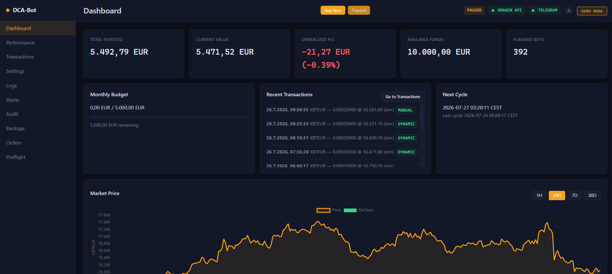
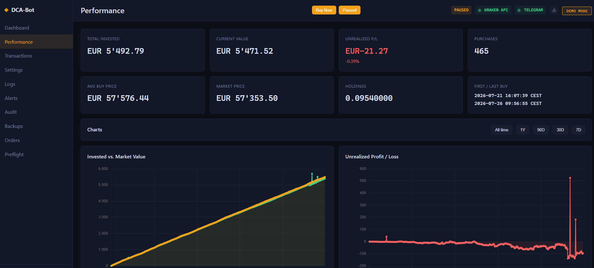
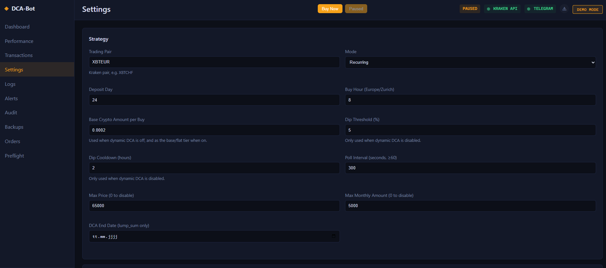
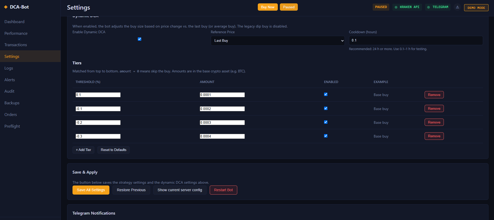

# Kraken DCA Bot — Automated Cryptocurrency Dollar Cost Averaging

A secure, self-hosted bot for automated Dollar Cost Averaging (DCA) on the Kraken exchange, with a built-in FastAPI web dashboard. Runs as a single hardened container; credentials are entered in the dashboard UI and stored in a local secrets store on your own machine — a JSON file protected by filesystem permissions (mode 0600), never in the config file, never in Git, never in backups.

## Features

- **Recurring DCA** — spreads your available fiat evenly across buys until the next deposit day (configurable hour and day of month)
- **Lump-sum DCA** — deploy a one-time amount evenly over a defined window until a target end date
- **Dynamic DCA tiers** — automatically scales each buy with the price trend: buy more when the price drops, skip or reduce when it rises. Tier table fully configurable in the dashboard
- **Production preflight** — a comprehensive read-only check suite (30+ checks: credentials, balance, market data, order state, security) to run before going live; results are advisory with manual acknowledgements, and every real order is independently re-validated at time of placement
- **Web dashboard** — portfolio, performance charts (30/90/180/365 days), transactions, live controls (Buy Now, Pause, Live Trading toggle), settings, logs, alerts with acknowledge-all, audit trail, backups. A skipped buy is never silent: it shows up as an alert, and Buy Now asks for a one-time over-budget approval when the monthly budget is spent
- **In-app credential management** — Kraken API keys, Telegram token, local admin password, and Authentik (OIDC) are entered in Settings and stored in `data/secrets.json` (mode 0600), never in `config.json`, never in backups
- **Dry-run by default** — the bot starts in dry-run mode; live trading is enabled explicitly via the dashboard toggle. Every live order is re-validated at placement time (environment, demo mode, live flag, bot state, unresolved order attempts, idempotency, current exchange metadata)
- **Telegram notifications** — startup, buy, and error alerts; plus an interactive command bot (`/status`, `/price`, `/buy`, `/pause`, …) with chat-ID allow-list, one-time confirmations, and full audit logging — no inbound ports needed
- **Order safety** — order attempts tracked with HOLD/UNKNOWN handling, cancel/retry/acknowledge from the dashboard, automatic reconciliation against Kraken
- **Hardened container** — non-root user, read-only root filesystem, dropped capabilities, no new privileges, resource limits
- **Security-first web UI** — bcrypt password hashing, signed sessions, CSRF protection, rate limiting, login lockout, optional OIDC single sign-on via Authentik
- **Auditable** — structured JSON logs with secret redaction, config change audit trail, detect-secrets pre-commit scanning

## Screenshots

**Dashboard** — portfolio KPIs, recent buys, and the market price chart with bot buys overlaid:



**Performance** — invested vs. market value and unrealized P/L over time:



**Strategy settings** — trading pair, schedule, budgets, and limits:



**Dynamic DCA tiers** — buy amounts that scale with the price trend, fully configurable:



## Quick Start (prebuilt image, ~2 minutes)

Prerequisites: Docker with the Compose plugin. A Kraken account.

```bash
mkdir kraken-dca-bot && cd kraken-dca-bot
curl -O https://raw.githubusercontent.com/mb86231/kraken-dca-bot/main/compose.public.yaml
docker compose -f compose.public.yaml up -d
docker compose -f compose.public.yaml logs -f   # look for the FIRST-RUN SETUP token
```

Open **http://localhost:8000** — on first run the login page is a **setup form**. Enter the setup token from the logs and choose your admin username and password. Then:

1. **Enter your Kraken credentials** — Settings → API Keys. Keys are stored in the container's data volume (`data/secrets.json`, permissions 0600), never in `config.json`.
2. **Configure your strategy** — Settings → Strategy (pair, amount, deposit day, Dynamic DCA tiers).
3. **Run preflight** — the Preflight page verifies everything (credentials, balance, market data, security). Acknowledge the two manual Kraken permission checks once you have verified them in your Kraken account.
4. **Enable live trading** — the toggle in the top bar. While off, the bot runs in dry-run mode and logs what it *would* buy.

To stop: `docker compose -f compose.public.yaml down`. Your data lives in the named Docker volumes `dca-bot-data`, `dca-bot-backups`, `dca-bot-logs`.

> **No `.env` needed.** The admin account is created via the first-run setup, the session secret is generated and persisted automatically, and all other secrets are entered in the dashboard. Power users can still pre-seed everything via environment variables (see [`docs/configuration.md`](docs/configuration.md)).

> **Access beyond localhost.** The quick-start binds to `127.0.0.1` only and serves plain HTTP — fine for a single machine. To reach the dashboard from other devices, put it behind an HTTPS reverse proxy (Caddy, nginx, Traefik), terminate TLS there, and expose the container by setting the bind address **in `.env`** (next to the compose file):
>
> ```env
> DCA_BOT_BIND=0.0.0.0
> WEB_UI_SECURE_COOKIE=true
> ```
>
> ```bash
> docker compose -f compose.public.yaml up -d
> ```
>
> Do not widen the port binding to plain HTTP on an untrusted network. And do **not** use a `compose.override.yaml` for the port: docker compose *merges* `ports` lists, so adding `8000:8000` there creates a second binding for the same host port and the container fails to start with a misleading `address already in use`. Use `DCA_BOT_BIND` instead — there is exactly one binding either way. Details: [`docs/WEB_DASHBOARD.md`](docs/WEB_DASHBOARD.md).

### Alternative: build from source

```bash
git clone https://github.com/mb86231/kraken-dca-bot.git
cd kraken-dca-bot
cp .env.example .env   # optional; everything can be set in the dashboard
docker compose up -d --build
```

See [`INSTALL.md`](INSTALL.md) for the full installation guide and [`docs/configuration.md`](docs/configuration.md) for every environment variable.

## Kraken API Setup

1. Log in to Kraken → **Settings → API**
2. Create a key with **only** these permissions:
   - ✅ Query Funds
   - ✅ Create & Modify Orders
   - ❌ Withdraw Funds — keep disabled
3. Enter the key and secret in the dashboard (Settings → API Keys) or via the `KRAKEN_API_KEY` / `KRAKEN_API_SECRET` environment variables (env vars take precedence).

## How the Strategy Works

**Recurring mode.** The bot reads your available fiat balance, divides it by the per-buy amount, and spaces the buys evenly until the next deposit day at your configured hour. Each buy recalculates the schedule, so deposits and price movements are handled automatically.

**Lump-sum mode.** You deposit a fixed amount once; the bot spreads buys evenly between now and `dca_end_date`.

**Dynamic DCA.** When enabled, every buy (scheduled or triggered) picks its size from a tier table based on the price change since your last (or average) buy — e.g. flat market → base amount, −5 % → 1.5×, −20 % → 3×, +10 % → skip. The legacy fixed-percentage dip buy is disabled in favor of tiers. A configurable cooldown prevents over-buying during a crash.

## Documentation

| Document | Purpose |
|----------|---------|
| [`CHANGELOG.md`](CHANGELOG.md) | What changed in every release, and how to update |
| [GitHub Releases](https://github.com/mb86231/kraken-dca-bot/releases) | Published versions with notes and container images |
| [`INSTALL.md`](INSTALL.md) | Full installation guide |
| [`docs/INSTALLATION.md`](docs/INSTALLATION.md) | Step-by-step walkthrough: localhost-only, LAN/IP, or behind a reverse proxy |
| [`docs/configuration.md`](docs/configuration.md) | Complete `config.json` and environment-variable reference |
| [`docs/WEB_DASHBOARD.md`](docs/WEB_DASHBOARD.md) | Dashboard setup, reverse proxy, HTTPS |
| [`docs/TELEGRAM.md`](docs/TELEGRAM.md) | Telegram notifications and the interactive command bot |
| [`docs/operations/PRODUCTION_PREFLIGHT.md`](docs/operations/PRODUCTION_PREFLIGHT.md) | Preflight checks explained |
| [`docs/secrets.md`](docs/secrets.md) | Secret management and rotation |
| [`docs/SECURITY_HARDENING.md`](docs/SECURITY_HARDENING.md) | Rate limits, brute-force protection, CSP, container hardening |
| [`docs/operations/`](docs/operations/) | Runbooks: backups, incidents, order failures, go-live checklist |
| [`docs/development.md`](docs/development.md) | Development setup and quality gates |
| [`ARCHITECTURE.md`](ARCHITECTURE.md) | Module overview and data flow |
| [`SECURITY.md`](SECURITY.md) | Security policy and vulnerability reporting |

## Testing

```bash
pip install -r requirements-dev.txt
pytest tests/ -v
```

Or try the dashboard without real credentials (demo mode with synthetic data, no orders possible):

```bash
export DEMO_MODE=true
export WEB_UI_PASSWORD_HASH=$(python scripts/generate_password_hash.py "demo-password")
export SESSION_SECRET=$(python -c "import secrets; print(secrets.token_hex(32))")
python scripts/generate_demo_data.py
python scripts/run_web_demo.py
# open http://127.0.0.1:8000 and sign in with demo-password
```

## Updating

```bash
docker compose -f compose.public.yaml pull
docker compose -f compose.public.yaml up -d
```

## Security Summary

- Credentials never in `config.json`, never in Git, never in backups; secrets store file is mode 0600 inside the data volume
- Dashboard protected by bcrypt-hashed password and/or OIDC (Authentik), signed sessions, CSRF tokens, rate limiting, login lockout
- Container: non-root (UID 1500), read-only root FS, `cap_drop: ALL`, `no-new-privileges`
- Live orders require `APP_ENV=production`, demo mode off, and live trading enabled; each order is independently re-validated at placement time (preflight results are advisory)
- `detect-secrets` baseline + pre-commit hooks; 440+ automated tests

See [`SECURITY.md`](SECURITY.md) for the full policy. Report vulnerabilities privately via GitHub (see Security Advisories) — do not open public issues for security problems.

## Troubleshooting

**API connection failed / invalid key** — re-enter the key and secret in Settings → API Keys; verify key permissions and expiry on Kraken.

**`volume minimum not met`** — increase the buy amount so `amount × price` is above Kraken's order minimum (typically ~10 in your quote currency).

**Trading pair not found** — use Kraken's exact pair names (`XXBTZUSD`, not `BTCUSD`); full list at https://api.kraken.com/0/public/AssetPairs.

**Dashboard unreachable** — `docker compose -f compose.public.yaml logs -f` and check the healthcheck; the container publishes on port 8000.

## Project Structure

```
kraken-dca-bot/
├── main.py                # Application entrypoint
├── bot/                   # Trading engine (strategy, Kraken client, preflight, state)
├── web/                   # FastAPI dashboard (templates, static assets, routers)
├── scripts/               # Entrypoint, healthcheck, backup/restore, demo data, tooling
├── tests/                 # Test suite (pytest)
├── config.json            # Bot configuration (documented, no secrets)
├── compose.public.yaml    # Quick start (prebuilt image)
├── compose.yaml           # Full compose (builds from source)
├── Dockerfile
├── requirements.txt       # Runtime dependencies
├── requirements-dev.txt   # Test/scan dependencies
├── .env.example           # Environment variable template
├── docs/                  # Full documentation
└── LICENSE                # MIT
```

## License

MIT License — see [`LICENSE`](LICENSE). The license retains the copyright notice of the original author, whose MIT-licensed code this project includes.

## Disclaimer

**This software handles real financial transactions. Use at your own risk.**

- Test with small amounts first; the bot starts in dry-run mode
- Never invest more than you can afford to lose
- Cryptocurrency trading carries significant risk; this is not financial advice
- The authors are not responsible for financial losses

## Contributing

1. Fork the repository
2. Create a feature branch
3. Make your changes (quality gates: `pytest`, `ruff`, `mypy`, `detect-secrets` — see [`docs/development.md`](docs/development.md))
4. Submit a pull request

---

**Dashboard, dynamic DCA, preflight, and secrets-store features by [mb86231](https://github.com/mb86231). Includes MIT-licensed code by the original author — see [`LICENSE`](LICENSE).**
